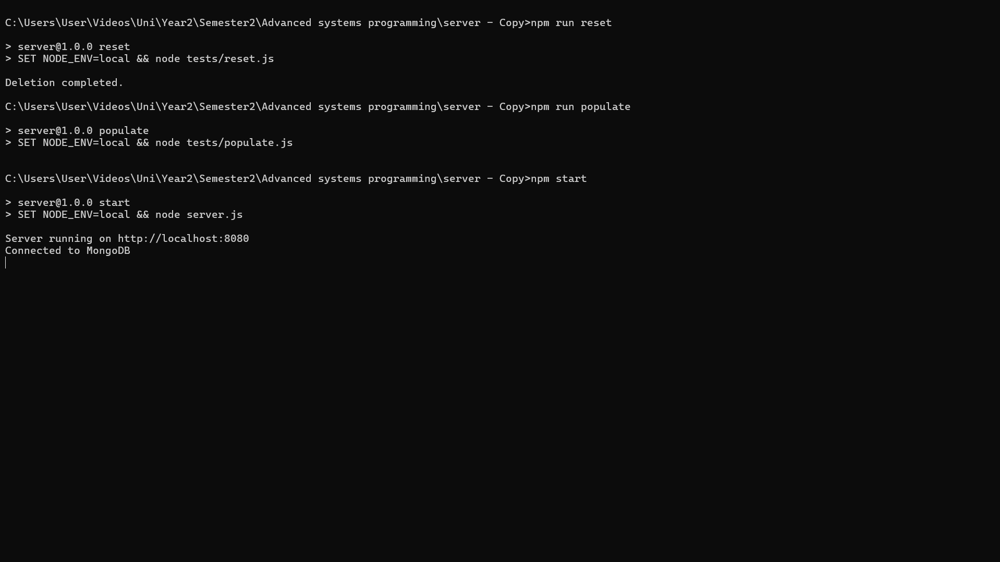

The TCP server we built in C++ can only run on Linux, whereas the Node.js server is compatible with Windows, macOS, and Linux as long as you can connect to MongoDB.

**Setup Instructions:**

1. **Modify Scripts for macOS/Linux:** If you are using macOS or Linux, you must first modify the start, reset, and populate scripts in the package.json file to suit your environment.

2. **Install Dependencies:** After cloning this repository, install the necessary dependencies by running npm install in the terminal.

3. **Connect to MongoDB:** Ensure you are connected to a MongoDB deployment.

4. **Update Environment Variables:** If needed, update the environment variables and adjust the port number at line 16 of TcpServer/server.cpp.

5. **Compile and Run the C++ Server**: Navigate to the TcpServer folder and run make, followed by ./server to compile and run the C++ server.

6. **Database Setup**:

+ Run npm run reset to drop the existing database.
+ Run npm run populate to initialize the database with default information.
+ Finally, run npm start to activate the Node.js server.

**Web App Usage:**

1. **Access the Web App**: Open your browser and go to http://localhost:8080/ (adjust the port number based on your configuration). You should see the main page.

2. **Sign In**: Click the 'Sign In' button at the top right corner and enter your username and password.

3. **Sign Out**: Click on your profile picture at the top right corner to sign out. You can also edit or delete users from this menu.

4. **Sign Up**: To create a new account, click the 'Sign In' button again and select 'Create Account'.

5. **Add a Video**: Click on the 'Add Video' button in the left menu to upload a new video.

After adding a video, it should appear on the main page.

6. **Edit a Video**: To edit a video, click the 'Edit' button below it. For example, you can change the video title. You can also delete your videos from this page.

I will now explain how the video recommendations work:
Suppose User1 watches Video6 and video1.

Now, when User2 watches Video6, Video1 appears in the recommendations because a user who watched Video6 also watched Video1.

The same can be observed when User2 watches Video1.

Suppose User2 also watches Video18.

Now, when User3 watches Video1, Video6 appears in the recommendations because two users who watched Video6 also watched Video1. Video18 also appears after Video6 because one user who watched Video18 also watched Video1.

**Android App Usage:**
1. **Access the Android App**: Clone our Android repository on Android Studio and start the app on an emulator.

2. **Sign In**: Click the user logo at the bottom right corner and enter your username and password.

3. **Sign Out**: Click on your profile picture at the bottom right corner to sign out. You can also edit or delete users from this menu.

4. **Sign Up**: To create a new account, click the user logo at the bottom right corner again and select 'Create Account'.

5. **Add a Video**: Click on the plus icon at the bottom center to upload a new video.

6. **Edit a Video**: To edit a video, click the three dots icon next to the video. You can also delete your videos from this menu.

